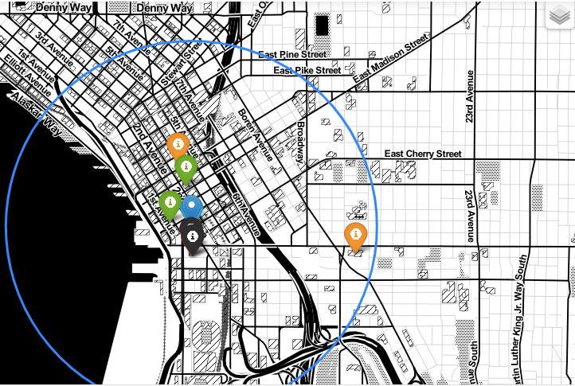

# Mini-proyect-geo by Adrián Madrid

## OBJETIVO

**EN ESTE PROYECTO, DEBÍAMOS BUSCAR UNA OFICINA QUE SE ADECÚE A LAS NECESIDADES DE SUS EMPLEADOS, UNA SERIE DE REQUISITOS POR LAS QUE
FUERAMOS DESCARTANDO OTRAS,Y QUE IBAMOS FILTRANDO EN LA BASE DE DATOS COMPANIES QUE SE PUEDE ENCONTRAR EN MONGO DB.** 

---SE ELIGIÓ PREVIAMENTE UNA OFICINA Y EN BASE A ELLA EMPEZAMOS A BUSCAR ENTRE LOS REQUISITOS QUE SE NOS PEDÍAN------

HICE UN FILTRADO INICIAL CON LA CIUDAD DE SEATTLE, Y VI QUE APARECÍAN UNAS CUÁNTAS, ASIQUE ME QUEDE CON LA PRIMERA COMPAÑÍA, Y DENTRO
DE ESA COMPAÑÍA, ELEGÍ UNA OFICINA, Y ME QUEDARÍA CON LO ÚNICO QUE ME IMPORTABA: "SU LOCALIZACION".

## REQUISITOS ELEGIDOS

**YA TENÍA MI OFICINA ELEGIDA, PERO DEBÍA COMPROBAR QUE CUMPLÍA UNOS CUANTOS REQUISITOS MINIMOS PARA QUE FUERA ELEGIDA, PORQUE SINO,
TENDRÍA QUE CAMBIARME A OTRA, Y SEGUIR INTENTANDOLO.**

Afortunadamente encontre concretamente 5 de los 9 requisitos que me pedían:

-Encontre peluquerias cercanas para el perro de oficina "pepe" que requería de peluquería todos los meses.
-Encontre salas de fiesta para la gente joven de la empresa.
-Encontre también agencias de viajes cercanas, para los empleados de cuentas que les gusta viajar mucho.
-Además, pude localizar un starbucks que solo se encontraba a 4 minutos de la oficina!!!
-Finalmente, y de las cosas más importantes que encontré, fue los colegios, tanto para chavales de secundaria, como para
chicos de primaria. Además pude sacar sus valoraciones.

Todas estas busquedas, se realizaron mediante la API de google maps con la que trabajé de manera óptima, ya que esta desarrollada de
una manera muy profesional. Necesité de una clave para ello, y tuve que guardarla en un archivo env para ocultarla del código así 
como crear un archivo gitignore para no subirlo al github junto con el proyecto.
Saque de la API todas las localizaciones de los sitios buscados para usarlos posteriormente a la hora de crear un mapa que sitúe tanto la oficina como los citados anteriormente.

## CREACION DEL MAPA

**POSTERIORMENTE, DESDE JUPITER NOTEBOOK, Y MEDIANTE UNA SERIE DE LIBRERIAS IMPORTADAS, CREÉ EL MAPA QUE CONTENDRIA LA LOCALIZACIÓN DE
LA OFICINA, Y LA DE LOS LUGARES REQUERIDOS POR LA EMPRESA.

-Se puede ver en el mapa la leyenda de todos los lugares para que se puedan comparar mejor con la distancia de la oficina, y además
se añadieron colores a los marcadores representado cada uno un tipo de lugar, es decir:
 ++marcadores rojos para las discotecas++
 ++marcadores verdes para las agencias de viaje++
 ++marcador azul para el starbucks++
 ++marcadores naranjas para las escuela primaria y la secundaria++
 ++marcadores negros para las peluquerías++
 
 Todo esto para que se vea más claramente.
 
 Finalmente,guardé el mapa en formato html.
 

## MATERIAL

EL ARCHIVO **API_MAPS.PY** DONDE SE ENCUENTRA EL CÓDIGO DONDE USE LA API DE GOOGLE MAPS
ARCHIVO DE **MAPA.HTML** DONDE SE ENCUENTRA EL MAPA GUARDADO.
**MAPA.PNG** IMAGEN DEL MAPA
**CREACION_MAPA.PNG**  DONDE SE ENCUENTRA EL CODIGO PARA LA CREACION DEL MAPA

<https://maps.googleapis.com> API DE GOOGLE MAPS.

