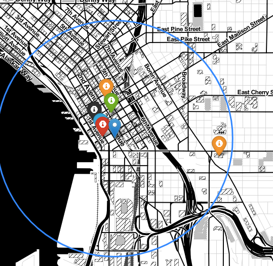

# Mini-proyect-geo by Adrián Madrid

## OBJETIVO

En este proyecto, el objetivo era quedarnos con una oficina que cumpliera una serie de requisitos. Partiamos de una base de datos
donde se encontraban muchisimas compañías cada una con sus diferentes oficinas. Los requisitos eran lugares que pudieran satistacer
la necesidad de los empleados.

## REQUISITOS ELEGIDOS

Empece primordialmente por hacer un filtro por la ciudad de Seattle que veia que se encontraba en muchas de las compañías de nuestra base de datos, y luego posteriormente reduje a 10 el numero de oficinas situadas en esa ciudad porque eran demasiadas.

Afortunadamente encontre concretamente 5 de los 9 requisitos que me pedían:

-Encontre una peluqueria cercana para el perro de oficina "pepe" que requería de peluquería todos los meses.
-Encontre una sala de fiesta para la gente joven de la empresa.
-Encontre también una agencia de viaje cercana, para los empleados de cuentas que les gusta viajar mucho.
-Además, pude localizar un starbucks que estaba pegadisimo
-Finalmente, y de las cosas más importantes que encontré, fue los colegios, tanto para chavales de secundaria, como para
chicos de primaria. Además pude sacar sus valoraciones.

Todas estas busquedas, se realizaron mediante la API de google maps con la que trabajé de manera óptima, ya que esta desarrollada de
una manera muy profesional. Necesité de una clave para ello, y tuve que guardarla en un archivo env para ocultarla del código así 
como crear un archivo gitignore para no subirlo al github junto con el proyecto.
Saque de la API todas las localizaciones de los sitios buscados para usarlos posteriormente a la hora de crear un mapa que sitúe tanto la oficina como los citados anteriormente.

## MATERIAL
EL ARCHIVO **API_MAPS.PY** ES DONDE SE ENCUENTRA EL CÓDIGO DONDE USE LA API DE GOOGLE MAPS, EN EL APLICO LAS APIS DE BUSQUEDA POR CERCANIA Y POR BUSQUEDA DE TEXTO. PARTO DE LAS COORDENADAS DE LA CIUDAD DE SEATTLE EMPEZANDO POR BUSCAR UN COLEGIO DE ESCUELA SECUNDARIA QUE ERA UNO DE LOS REQUISITOS QUE EL PROYECTO EXIGIA. ESTO LO HICE MEDIANTE LA API DE GOOGLE MAPS DE BUSQUEDA POR TEXTO.
UNA VEZ ELEGIDO ESE COLEGIO, LA IDEA ES QUE MEDIANTE LA API DE BUSQUEDA CERCANA QUE TIENE GOOGLE, HEMOS BUSCADO LOS OTROS REQUISITOS EN BASE A LA CERCANIA CON EL COLEGIO DE SECUNDARIA, MENOS CON EL STARBUCKS QUE HA SIDO A RAIZ DE LAS COORDENADAS DE LAS DISCOTECA DEBIDO A ERRORES CON LA BUSQUEDA. 
NOS QUEDAMOS CON UN LUGAR DE CADA BUSQUEDA Y CON SU LOCALIZACION QUE HEMOS TENIDO QUE USAR PARA FILTRAR
UNO A UNO CADA UNA DE LAS OFICINAS.

EL ARCHIVO **FILTRADO_OFICINAS.PY** ESTA LA FILTRACION QUE HE IDO HACIENDO A CADA UNA DE LAS 10 OFICINAS QUE TENIAMOS Y SE HA HECHO A MEDIDA QUE IBAMOS ENCONTRANDO UN LUGAR NUEVO CERCANO. ¿COMO SE HA HECHO?
HEMOS TENIDO QUE INSTALAR LA LIBRERIA GOOGLE MAPS EN PYTHON Y USAR LA API DE DISTANCIA MUY EFECTIVA PARA CALCULAR LA DISTANCIA ENTRE DOS COORDENADAS. EMPEZABAMOS CON LA ESCUELA SECUNDARIA Y MEDIAMOS LA DISTANCIA CON LAS OFICINAS, E IBAMOS DESCARTANDO LAS QUE MÁS LEJOS ESTABAN, LUEGO BUSCABAMOS OTRO LUGAR CERCANO, COMO UNA ESCUELA DE PRIMARIA, Y HACIAMOS LO MISMO. y ASI.. HASTA QUEDARNOS CON LA OFICINA ELEGIDA. ES INTERESANTE RECALCAR QUE NOS QUEDAMOS FINALMENTE CON DOS, ¡¡¡QUE RESULTO SER LA MISMA OFICINA!!!!

ARCHIVO DE **MAPA.HTML** DONDE SE ENCUENTRA EL MAPA GUARDADO.
**MAPA.JPG** IMAGEN DEL MAPA

EN EL ARCHIVO **FILTRO_PYMONGO** SE ENCUENTRA EL FILTRO QUE SE LE HIZO A LA BASE DE DATOS PARA QUEDARNOS CON LAS 10 COMPAÑIAS.

**CREACION_MAPA.PNG**  DONDE SE ENCUENTRA EL CODIGO PARA LA CREACION DEL MAPA

-Se puede ver en el mapa la leyenda de todos los lugares para que se puedan comparar mejor con la distancia de la oficina, y además
se añadieron colores a los marcadores representado cada uno un tipo de lugar, es decir:
 marcador rojo para las discoteca
 marcador verde para la agencia de viaje
 marcador azul para el starbucks
 marcador naranja para las escuela primaria y la secundaria
 marcador negro para las peluqueria
 
Todo esto para que se vea más claramente.
Finalmente,guardé el mapa en formato html.
 

<https://maps.googleapis.com> API DE GOOGLE MAPS.

